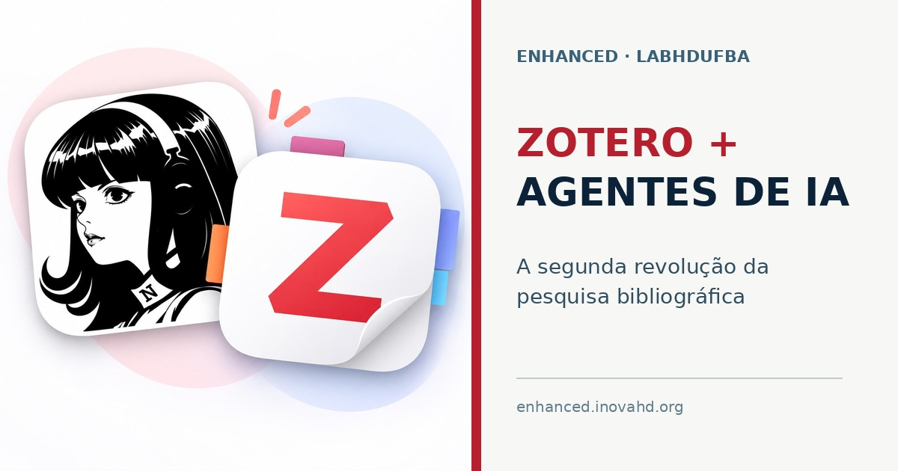

  Idioma:
  <button type="button" class="article-lang-btn article-lang-active" data-article-lang="pt">PT</button>
  <button type="button" class="article-lang-btn" data-article-lang="en">EN</button>

::: {.article-version data-article-version="pt"}

Uma das primeiras ferramentas tecnológicas que aprendi a usar na pesquisa em ciências sociais foi um gerenciador de referências bibliográficas.

Sua função parece simples: organizar referências em um banco de dados. Cada registro reúne informações como autoria, título, data de publicação e edição, além de identificar o tipo de documento, seja livro, artigo, capítulo, vídeo, tese ou relatório. Esses dados permitem inserir citações nos textos e gerar automaticamente a bibliografia no formato desejado.

Com o tempo, porém, um gerenciador de referências se torna algo mais importante: uma memória organizada da pesquisa.

## Do EndNote ao Zotero

Só conheci esse tipo de ferramenta no início do doutorado. Naquela época, meu orientador pagou e compartilhou comigo uma assinatura do EndNote. Passei a utilizá-lo para inserir referências nos documentos digitais que estava escrevendo.

Já no final do doutorado, descobri o [Zotero](https://www.zotero.org/), um software gratuito e de código aberto voltado ao gerenciamento individual e colaborativo de referências bibliográficas.

Para mim, essa mudança foi revolucionária. O Zotero permitia construir bibliotecas compartilhadas, organizar coletivamente um campo de estudos e manter acessível o conjunto de textos com os quais uma pesquisa dialoga.

## Citar é participar de uma conversa

A importância do Zotero está ligada ao sentido epistemológico da citação.

A ciência é uma grande conversa. Dialogamos com a produção intelectual do passado e com o que está sendo produzido no presente. Concordamos com determinadas interpretações, refutamos outras, retomamos problemas antigos e formulamos novas perguntas.

Citar significa situar uma afirmação nessa conversa. A referência identifica nossos interlocutores, explicita dívidas intelectuais e permite que outras pessoas reconstruam o caminho percorrido por um argumento. Debater, concordar e refutar fazem parte do substrato da citação.

Por isso, uma biblioteca bibliográfica não é apenas um arquivo auxiliar. Ela materializa parte da orientação teórica e metodológica de uma pesquisa.

## Uma biblioteca coletiva no LABHDUFBA

Desde então, o Zotero se tornou praticamente obrigatório nas pesquisas que desenvolvo e nas atividades do Laboratório de Humanidades Digitais da UFBA, o LABHDUFBA.

Pesquisadores em diferentes níveis de formação, da iniciação científica ao doutorado, utilizam a ferramenta. Costumo resumir essa regra de maneira bastante direta:

> Eu não leio texto que não esteja no Zotero.

A frase pode soar exagerada, mas expressa uma prática importante. Quando um texto entra no Zotero, ele deixa de ser um arquivo isolado no computador de alguém. Passa a integrar um acervo coletivo, pesquisável e organizado. Pode receber tags, notas, anexos e relações com outros documentos.

Hoje, mantemos uma biblioteca colaborativa ampla sobre humanidades digitais e áreas correlatas, como história digital, sociologia digital e ciência social computacional. Esse acervo sustenta parte de nossa orientação teórico-metodológica e preserva a memória intelectual das pesquisas desenvolvidas no laboratório.

## O soterramento de dados

A produção acadêmica contemporânea enfrenta um problema cada vez mais evidente: a quantidade de material publicado supera nossa capacidade individual de acompanhar, organizar e ler tudo o que pode ser relevante.

Tenho chamado esse problema de **soterramento de dados**.

Há muitos artigos, livros, relatórios, preprints e outros documentos sendo produzidos continuamente. Encontrar um texto relevante já é difícil. Mais difícil ainda é lembrar que ele existe, registrar por que ele importa e recuperá-lo no momento adequado.

O problema não é apenas o acesso à informação. Precisamos criar condições para selecionar, organizar, relacionar e recuperar materiais em meio a um fluxo permanente de publicações.

O Zotero já oferecia uma resposta parcial a esse problema. Ainda restava, porém, muito trabalho manual: revisar metadados, criar coleções, aplicar tags, localizar duplicações, produzir fichamentos e reorganizar bibliotecas acumuladas durante anos.

## A integração com agentes de inteligência artificial

Nos últimos dois meses, graças ao trabalho de [Lídia Belas](https://labhdufba.github.io/authors/28_lidia), bolsista de iniciação científica do laboratório, integramos o Zotero aos nossos agentes de inteligência artificial.

Essa integração produziu aquilo que considero uma segunda revolução do Zotero.

A primeira mudança aparece na organização da biblioteca. Os agentes auxiliam na revisão de coleções, na aplicação de tags e na correção de informações incompletas ou incorretas nas referências. Tarefas que antes precisavam ser realizadas manualmente, item por item, agora podem ser executadas em escala.

A segunda mudança diz respeito à incorporação de novas publicações. Artigos identificados como relevantes podem ser coletados, inseridos no Zotero e acompanhados de um fichamento inicial. Quando retornamos a esse material, já encontramos uma referência organizada, com informações que facilitam sua recuperação e contextualização.

O fichamento produzido pelos agentes não encerra o trabalho intelectual. Ele prepara o material para a leitura, a verificação e a interpretação humanas. Os pesquisadores continuam responsáveis por avaliar argumentos, confrontar evidências, identificar limites e acrescentar os insights que surgem durante a leitura.

A inteligência artificial amplia nossa capacidade de organização e recuperação. A construção do sentido continua sendo uma tarefa humana.

## Uma infraestrutura de pesquisa

Não vou me alongar, neste texto, nos aspectos técnicos da integração entre o Zotero e os agentes de IA. O que importa, por enquanto, é a mudança na escala e na forma de trabalhar.

O Zotero começou, para mim, como uma ferramenta para inserir citações em documentos. Depois, tornou-se o espaço de organização de uma biblioteca coletiva. Agora, integrado aos agentes de inteligência artificial, passa a funcionar como uma infraestrutura ativa de pesquisa: recebe, organiza e ajuda a recuperar um acervo em permanente expansão.

É isso que chamo de segunda revolução do Zotero.

Para a pesquisa que desenvolvemos no LABHDUFBA, esse é um caminho sem volta.

*Observação: este texto foi elaborado a partir de uma fala de Leonardo F. Nascimento, com auxílio do Hermes Agent na transcrição, na revisão e na tradução para o inglês.*

:::

::: {.article-version data-article-version="en"}

One of the first digital tools I learned to use in social science research was a reference manager.

Its function seems simple: organizing references in a database. Each record contains information such as authorship, title, publication date, and edition, while also identifying the type of document, whether a book, article, chapter, video, thesis, or report. These data make it possible to insert citations into a text and automatically generate a bibliography in the required style.

Over time, however, a reference manager becomes something more important: an organized memory of the research process.

## From EndNote to Zotero

I first encountered this kind of tool at the beginning of my doctorate. At the time, my supervisor paid for an EndNote subscription and shared it with me. I began using it to insert references into the digital documents I was writing.

Near the end of my doctorate, I discovered [Zotero](https://www.zotero.org/), a free and open-source tool for managing references individually or collaboratively.

For me, that change was revolutionary. Zotero made it possible to build shared libraries, collectively organize a field of study, and keep accessible the body of texts with which a research project is in dialogue.

## Citation means joining a conversation

Zotero's importance is tied to the epistemological meaning of citation.

Science is a vast conversation. We engage with intellectual work from the past and with research being produced in the present. We agree with certain interpretations, reject others, revisit old problems, and formulate new questions.

To cite is to place a claim within that conversation. A reference identifies our interlocutors, acknowledges intellectual debts, and enables others to reconstruct the path followed by an argument. Debate, agreement, and refutation are part of the substance of citation.

A bibliographic library is therefore more than an auxiliary archive. It gives material form to part of a research project's theoretical and methodological orientation.

## A shared library at LABHDUFBA

Since then, Zotero has become practically mandatory in the research I conduct and in the activities of the Digital Humanities Laboratory at the Federal University of Bahia, LABHDUFBA.

Researchers at different stages, from undergraduate research to the doctoral level, use the tool. I usually summarize this rule quite directly:

> I do not read a text that is not in Zotero.

The statement may sound exaggerated, but it expresses an important practice. When a text enters Zotero, it stops being an isolated file on someone's computer. It becomes part of a shared, searchable, and organized collection. It can receive tags, notes, attachments, and links to other documents.

We now maintain a substantial collaborative library on digital humanities and related areas, including digital history, digital sociology, and computational social science. This collection supports part of our theoretical and methodological orientation while preserving the intellectual memory of the research developed in the laboratory.

## Data burial

Contemporary academic production faces an increasingly visible problem: the volume of published material exceeds our individual capacity to follow, organize, and read everything that may be relevant.

I have been calling this problem **data burial**.

Articles, books, reports, preprints, and other documents are being produced continuously. Finding a relevant text is already difficult. Remembering that it exists, recording why it matters, and retrieving it at the right moment is harder still.

The problem is not simply access to information. We need conditions for selecting, organizing, relating, and retrieving materials amid a continuous flow of publications.

Zotero already offered a partial response to this problem. A considerable amount of manual work nevertheless remained: reviewing metadata, creating collections, applying tags, finding duplicates, preparing reading notes, and reorganizing libraries accumulated over many years.

## Integrating artificial intelligence agents

Over the past two months, thanks to the work of [Lídia Belas](https://labhdufba.github.io/authors/28_lidia), an undergraduate research fellow at the laboratory, we have integrated Zotero with our artificial intelligence agents.

This integration has produced what I consider a second Zotero revolution.

The first change concerns library organization. Agents assist with reviewing collections, applying tags, and correcting incomplete or inaccurate reference data. Tasks that previously had to be performed manually, one item at a time, can now be carried out at scale.

The second change concerns the incorporation of new publications. Articles identified as relevant can be collected, added to Zotero, and accompanied by an initial reading note. When we return to this material, we find an organized reference with information that facilitates retrieval and contextualization.

The notes produced by agents do not conclude the intellectual work. They prepare the material for human reading, verification, and interpretation. Researchers remain responsible for evaluating arguments, confronting evidence, identifying limitations, and adding the insights that emerge during reading.

Artificial intelligence expands our capacity for organization and retrieval. The construction of meaning remains a human task.

## A research infrastructure

I will not discuss the technical details of the integration between Zotero and AI agents here. What matters for now is the change in scale and in our way of working.

For me, Zotero began as a tool for inserting citations into documents. It later became the organizing space for a shared library. Now, integrated with artificial intelligence agents, it operates as an active research infrastructure: receiving, organizing, and helping us retrieve a continuously expanding collection.

This is what I call Zotero's second revolution.

For the research we conduct at LABHDUFBA, there is no turning back.

*Note: this article was developed from an oral account by Leonardo F. Nascimento, with Hermes Agent assisting in transcription, editing, and translation into English.*

:::
